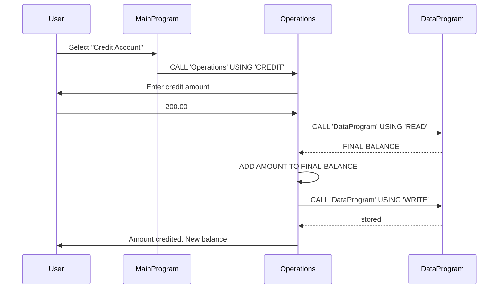
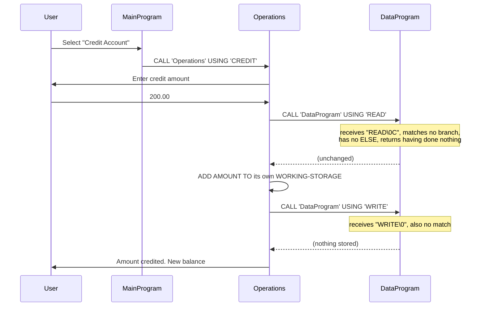

# Modernising a legacy COBOL accounting system with GitHub Copilot

A hands-on lab for migrating a COBOL account management system to Node.js **without
silently changing what it does**.


> This is a fork of [`continuous-copilot/modernize-legacy-cobol-app`](https://github.com/continuous-copilot/modernize-legacy-cobol-app),
> rebuilt around an executable golden-master harness and the 2026 GitHub Copilot
> customisation surface. See [`docs/WHATS-NEW.md`](docs/WHATS-NEW.md) for the full
> list of changes and why each one was made.

---

## The point of this repository

Ask any capable model to translate 90 lines of COBOL to JavaScript and you will get
plausible, readable, confident code in seconds. On this program, that code is wrong in
at least three ways that no reviewer would catch by reading it:

| What a careful port produces | What the COBOL actually does | Finding |
| --- | --- | --- |
| Credit `999000.00` onto `1000.00` → `1000000.00` | → `0.00`, reported as a **successful credit** | [`L-01`](docs/LEGACY-BEHAVIOR.md#l-01) |
| Credit `-100.00` → balance falls to `900.00` | → balance **rises** to `1100.00` | [`L-02`](docs/LEGACY-BEHAVIOR.md#l-02) |
| A working three-tier data layer, per the docs | `data.cob` runs but **never matches an operation**, so it stores nothing | [`L-10`](docs/LEGACY-BEHAVIOR.md#l-10) |

Better models do not fix this. They make it worse, because a more capable model writes
a more convincing wrong answer. The problem is not reasoning quality — it is that the
model was asked to translate a program it had no way to *observe*.

So this repository makes the legacy system's behaviour **executable** first, and only
then migrates it.

```bash
npm run parity:node
# 26/26 scenarios matched, 14 legacy defect(s) deliberately remediated.
# Parity holds.
```

---

## Quick start

Open in a [GitHub Codespace](https://codespaces.new/xavierxmorris/modernize-legacy-cobol-app)
or the devcontainer — GnuCOBOL, Node and the Copilot extensions are configured — then:

```bash
npm run build:cobol    # compile the legacy system
npm test               # 106 tests (26 skip without a COBOL compiler)
```

Locally you need Node 20.11+ and GnuCOBOL:

```bash
sudo apt-get update && sudo apt-get install -y gnucobol3   # Ubuntu/Debian
brew install gnucobol                                      # macOS
```

> The Ubuntu package is `gnucobol3` or `gnucobol4`. Plain `gnucobol` is a transitional
> package pulling the 4.0 pre-release, and on Ubuntu 20.04 it installs GnuCOBOL 2.2.
> CI and the devcontainer pin 3.1.2. GnuCOBOL 3.1.2 and 4.0-early-dev were verified to
> produce byte-identical output across all 26 scenarios.

There is no `npm install`. The project has zero dependencies.

---

## Commands

```bash
npm run parity:list      # every specified behaviour, strict vs quirk
npm run parity:record    # re-record the golden master from the COBOL binary
npm run parity:cobol     # prove the COBOL still matches its own golden master
npm run parity:node      # prove the Node port matches the specification
npm test                 # everything
```

The COBOL suites skip automatically when `build/accountsystem` is absent, so `npm test`
works without a compiler.

---

## The workflow

```
characterise  →  record  →  port  →  verify  →  declare
```

**Never assert what the legacy system does. Run it and record it.** Every claim in
[`docs/LEGACY-BEHAVIOR.md`](docs/LEGACY-BEHAVIOR.md) is backed by a transcript in
`parity/golden/`.

Each scenario in [`spec/scenarios.json`](spec/scenarios.json) is either:

- **`strict`** — real business behaviour a port must reproduce exactly;
- **`quirk`** — a defect a port may reproduce (`--policy bug-for-bug`) or fix
  (`--policy modernized`).

Which gives you the trick that makes this whole thing work:

```bash
node parity/cli.mjs verify --target node --policy bug-for-bug
```

Under `bug-for-bug` the port must reproduce the legacy defects, so **every failure is a
behaviour you changed on purpose**. That failure list is your remediation manifest —
the thing a business stakeholder signs off — generated mechanically rather than
remembered. Anything in it you did not intend is a regression, found without anyone
reading a diff.

Full rationale: [`docs/MIGRATION-PLAYBOOK.md`](docs/MIGRATION-PLAYBOOK.md).

---

## The legacy system

Three COBOL programs, treated as read-only. They are the specification.

- `main.cob` — the menu loop
- `operations.cob` — credit, debit and view
- `data.cob` — *intended* to store the balance

### Documented architecture

This is what the original README describes, and what its sequence diagram shows:



### Actual architecture

This is what the program does, verified by instrumenting `data.cob` and by changing its
opening balance to `7777.77` and observing that the displayed balance did not move
([`L-10`](docs/LEGACY-BEHAVIOR.md#l-10)):



`operations.cob` passes the 4-character literal `'READ'` into a `PIC X(6)` linkage
item. The callee reads six bytes from a five-byte allocation, gets `READ` plus a NUL
and a stray byte, matches neither branch, and — because `data.cob` has no `ELSE` —
fails silently. `main.cob` avoids the same bug only because its literals happen to be
padded to exactly six characters: `'TOTAL '`, `'CREDIT'`, `'DEBIT '`.

The balance really lives in `operations.cob`'s own `WORKING-STORAGE`, which is why it
cannot survive a restart ([`L-09`](docs/LEGACY-BEHAVIOR.md#l-09)).

**This is the single best argument in the repository for characterisation testing.**
No amount of reading — by a human or a model — finds it. Ten seconds of running does.

---

## Copilot configuration

| Capability | Location |
| --- | --- |
| Repository instructions | [`.github/copilot-instructions.md`](.github/copilot-instructions.md) |
| Agent instructions | [`AGENTS.md`](AGENTS.md) |
| Path-specific instructions | [`.github/instructions/`](.github/instructions) |
| Prompt files | [`.github/prompts/`](.github/prompts) |
| Custom agents | [`.github/agents/`](.github/agents) |
| Agent skill | [`.github/skills/cobol-parity-check/`](.github/skills/cobol-parity-check) |
| Cloud agent environment | [`.github/workflows/copilot-setup-steps.yml`](.github/workflows/copilot-setup-steps.yml) |

Three custom agents form the workflow, each with a different scope and tool set:

- **`legacy-archaeologist`** — establishes ground truth by recording. Writes evidence
  and findings, never application code.
- **`migration-engineer`** — writes the port under the parity gate.
- **`parity-auditor`** — read-only. Verifies the claims independently.

Handoffs between them are wired into the agent frontmatter.

The boundaries are conventions plus CI, not sandboxes. The archaeologist has an
editing tool because recording evidence requires one; what stops it rewriting the
evidence is the `guard-recorded-artefacts` job, which re-records from the binary and
fails on any difference.

---

## Repository layout

```
main.cob  operations.cob  data.cob   the legacy system — read-only, it is the spec
spec/scenarios.json                  executable behavioural contract
parity/                              golden-master harness
parity/golden/                       recorded COBOL transcripts — never hand-edited
node-accounting-app/                 the modern port
tests/                               unit tests + parity suites
scripts/probes/                      re-runnable evidence for findings that need instrumentation
docs/LEGACY-BEHAVIOR.md              findings register, L-01 … L-10
docs/MIGRATION-PLAYBOOK.md           how and why to drive this with Copilot
docs/WHATS-NEW.md                    what changed from upstream
TESTPLAN.md                          the stakeholder-facing test plan
RUN-SHEET.md  PROMPTS.md             demo walkthrough and the prompts behind it
go.ps1                               one-command runner (uses Docker when GnuCOBOL is absent)
```

---

## Honesty notes

Things this repository claims, and exactly how far the evidence goes:

- **"Verified" means recorded.** Every finding is backed either by a scenario replayed
  in CI, or by a re-runnable script in [`scripts/probes/`](scripts/probes). Both are
  labelled in [`docs/LEGACY-BEHAVIOR.md`](docs/LEGACY-BEHAVIOR.md).
- **The compiler claim is narrow.** GnuCOBOL 3.1.2 and 4.0-early-dev on Ubuntu 24.04
  x86-64 produce byte-identical output across all 26 scenarios. Other compilers,
  dialect flags (`-std=`) and locales are untested. The `L-10` byte-level explanation
  in particular depends on how a compiler lays out literals passed by reference; the
  observable outcome is what matters for the migration.
- **The CI guard is a reproducibility check, not provenance enforcement.** It proves
  the committed evidence matches what the committed COBOL produces, and it rejects any
  `.cob` change outright. Branch protection and `CODEOWNERS` are the real control over
  who may change the specification.
- **Agent boundaries are conventions plus CI, not sandboxes.** The archaeologist agent
  holds an editing tool because recording evidence needs one.
- **The port is single-process.** Writes are atomic; the read-modify-write is not
  transactional. See [`node-accounting-app/README.md`](node-accounting-app/README.md).
- **Coverage is incomplete, on purpose.** Concurrency, TTY interaction, dialect flags
  and locale are listed as gaps at the end of `docs/LEGACY-BEHAVIOR.md` rather than
  quietly omitted.
- **The COBOL is unmodified.** Every defect described here is still present, because
  the defects are the exercise.

## A note on trust

GitHub Copilot is an AI pair programmer. It may produce completions that are not
perfect, safe, or suitable for production. Always review suggestions.

This repository's position is that "always review" is necessary but not sufficient for
legacy modernisation, because the failures shown above are invisible to review. What
review needs is an **oracle** — a command that returns a truthful pass or fail. That is
what `npm run parity:node` is for.

---

## Licence

MIT — see [LICENSE](LICENSE). Original work © the upstream authors.
